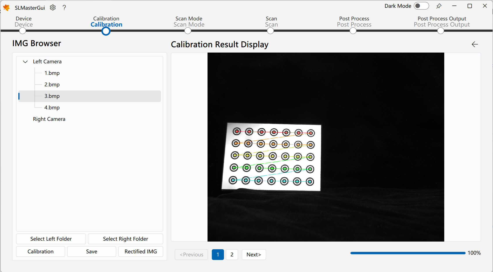
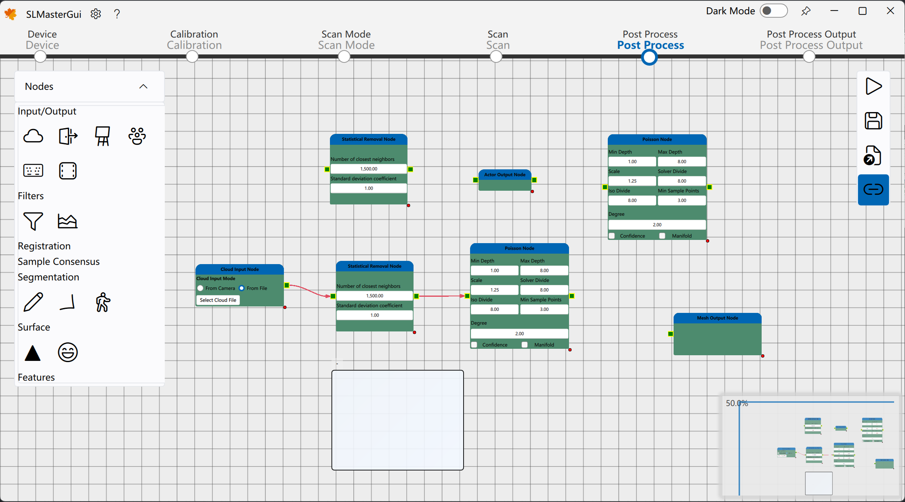

<h1 align="center">
  SLMaster
</h1>

 

[SLMaster](https://github.com/Practice3DVision/SLMaster)是一个较为完整的结构光3D相机软件。您可以使用它对任意被测物体完成静态扫描或者实时动态扫描。

该软件相关博客可见公众号专栏：[从0到1搭建一套属于你自己的高精度实时结构光3D相机](https://mp.weixin.qq.com/s/E8K3892eNVJfgpMUHtf9Lw)，欢迎关注公众号。

你的**Star**⭐和关注是博主源源不断的动力。有任何问题和**bug**反馈请提**Issue**。

**想先体验该软件？**

请在`Release`页面下载`exe`安装文件，但请注意`exe`安装方式不支持`GPU`加速。

## 依赖 🍁
**SLMaster**依赖的库包含如下几点：
- [FluentUI](https://github.com/Practice3DVision/SLMaster/tree/master/FluentUI) 
- [QuickQanava](https://github.com/cneben/QuickQanava/tree/2.4.1) 
- [MVSDK](https://www.irayple.com/cn/serviceSupport/downloadCenter/18?p=17) 
- [opencv_contribute](https://github.com/opencv/opencv_contrib.git) 
- [OpenCV](https://github.com/opencv/opencv.git) 
- [VTK](https://github.com/Kitware/VTK/tree/v9.2.0) 
- [PCL](https://github.com/PointCloudLibrary/pcl/tree/pcl-1.12.1)  
- [Qt5](https://doc.qt.io/qt-5/index.html) 

> 如果电脑没有`NVIDIA GPU`，软件仍然能够使用CPU加速有效运行，此时可无需`opencv_contribute`依赖。

## 编译 🚀
当你获取到本库代码之后，首先检查上述依赖，若不满足依赖条件，可通过点击上述依赖库跳转至对应的库，随后下载其代码并进行编译。以上面库皆没有编译安装的环境为例，编译顺序如下：

1. 下载[OpenCV](https://github.com/opencv/opencv.git)和[opencv_contribute](https://github.com/opencv/opencv_contrib.git)并进行编译（若`WITH_CUDA`未勾选请勾选上）
2. 下载[Qt5.15](https://doc.qt.io/qt-5/index.html)并选择`MSVC`编译套件安装
3. 下载[VTK](https://github.com/Kitware/VTK/tree/v9.2.0)并令`VTK_GROUP_ENABLE_Qt=YES`进行编译
4. 下载[PCL-1.12.1-AllInOne](https://github.com/PointCloudLibrary/pcl/releases)进行安装，安装完成后删除`PCL`安装文件夹下的除`3rdParty`外的其它任何文件，并将`3rdParty`文件夹中的`VTK`文件夹删除
5. 下载[PCL](https://github.com/PointCloudLibrary/pcl/tree/pcl-1.12.1)并选择好第三方库路径进行编译
6. 打开命令行窗口，键入`git clone --recursive https://github.com/Practice3DVision/SLMaster.git`克隆`SLMaster`
7. 打开`VSCode`编译运行`SLMasterGui`即可

> 注意！
> 每当编译好一个库都应当在系统环境变量中加入。例如，编译完成OpenCV后，设置好系统环境变量OpenCV_DIR路径。

你可以打开`SLMaster`中的`BUILD_TEST`选项，这将编译**google_test**中的测试用例，这些测试用例同样是一份非常不错的示例代码。
## 使用 🌈

离线使用情况下，可通过进入`扫描模式->离线扫描模式->选择左相机文件夹->选择右相机文件夹->开始扫描->单次扫描`测试离线重建效果，软件提供一组离线数据集位于`安装目录/data/`下。

如您需要更改算法参数以测试自己的离线数据集，请通过更改`安装目录/gui/qml/res/config`下的相机配置文件，该文件记录了**3D**相机所有的状态，包括硬件组成、算法参数等。

如您需要接入硬件并执行在线功能，请修改`安装目录/gui/qml/res/config`下的相机配置文件，确保硬件组成参数与您所用的硬件设备一致。
## 部分功能  💡

|功能|示例|功能|示例|
|:-|-|:-|-|
|单双三目重建||实时重建||
|硬件在线调试||条纹生成||
|相机标定||误差分布显示||
|投影仪标定||点云后处理||
