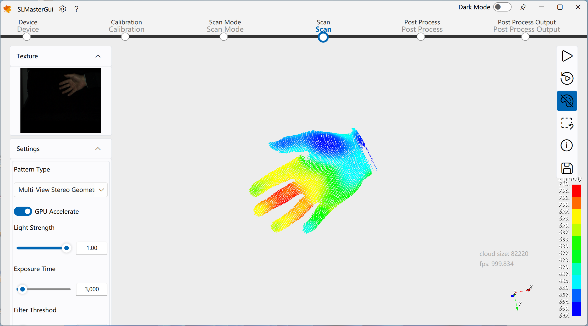
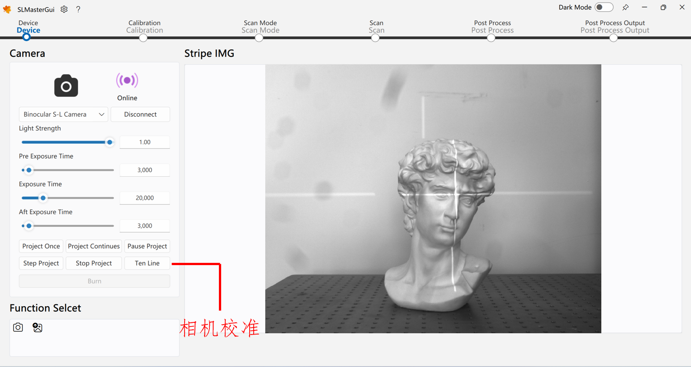
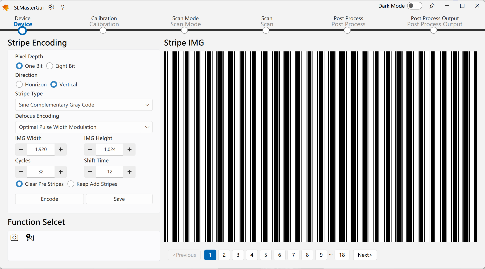
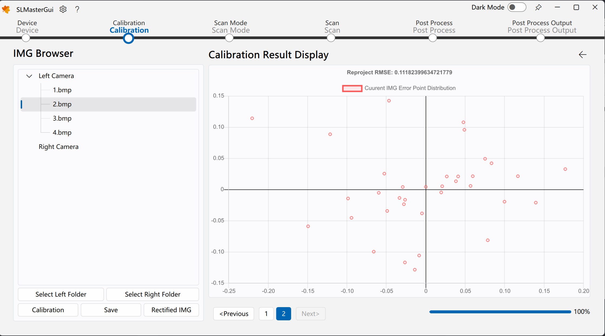
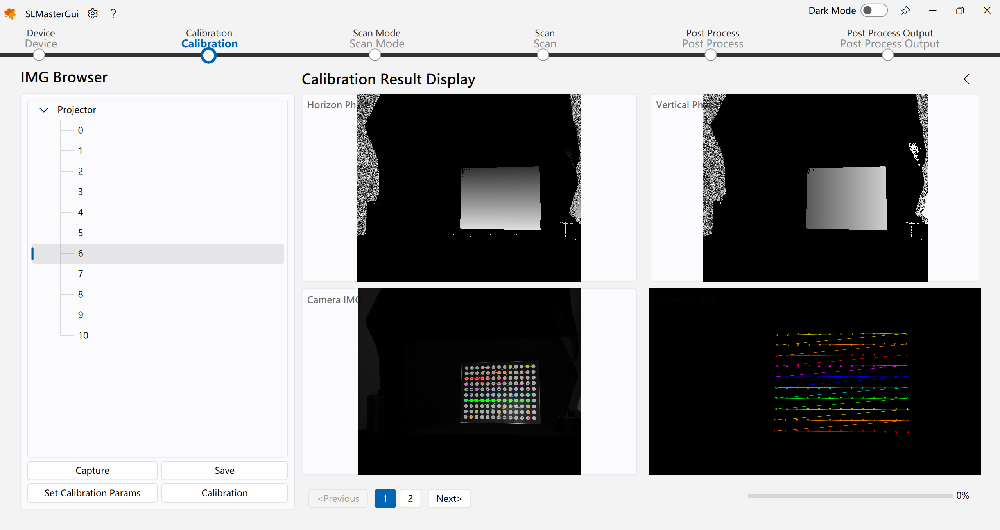
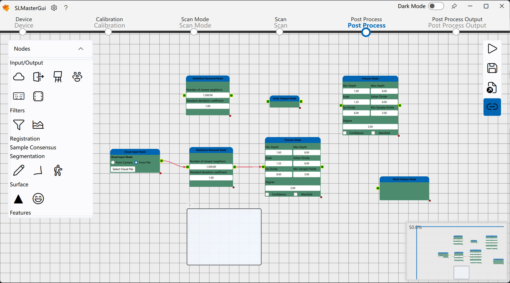

<h1 align="center">
  SLMaster
</h1>

![win-badge] ![release-badge] ![download-badge] ![download-latest]

[win-badge]: https://github.com/Practice3DVision/SLMaster/workflows/Windows/badge.svg  "Windows"
[win-link]: https://github.com/Practice3DVision/SLMaster/actions/workflows/windows.yml  "Windows"
[release-badge]: https://img.shields.io/github/release/Practice3DVision/SLMaster.svg "Release status"
[release-link]: https://github.com/Practice3DVision/SLMaster/releases "Release status"
[download-badge]: https://img.shields.io/github/downloads/Practice3DVision/SLMaster/total.svg "Download status"
[download-link]: https://github.com/Practice3DVision/SLMaster/releases/latest "Download status"
[download-latest]: https://img.shields.io/github/downloads/Practice3DVision/SLMaster/latest/total.svg "latest status"

English | <a href="README_CH.md">简体中文</a>

[SLMaster](https://github.com/Practice3DVision/SLMaster) is a relatively complete structured light 3D camera software. You can use it to perform static scanning or real-time dynamic scanning on any tested object.

The blog related to this software can be seen in the official account column: [Build your own high-precision real-time structured light 3D camera from 0 to 1](https://mp.weixin.qq.com/s/E8K3892eNVJfgpMUHtf9Lw)，Welcome to the official account。

Your **Star**⭐ and attention is my constant motivation. If you have any questions or feedback on bugs, please refer to the **Issue**.

**Want to experience the software first ?**

Please download the `exe` installation file from the `Release` page, but please note that the `exe` installation method does not support GPU acceleration.

For more usage and development documentation, please refer to [Wiki Document](https://github.com/Practice3DVision/SLMaster/wiki)。

## Dependencies 🍁
The libraries that **SLMaster** depends on include the following points:
- [FluentUI](https://github.com/Practice3DVision/SLMaster/tree/master/FluentUI)`V1.5.6` (The project includes)
- [QuickQanava](https://github.com/cneben/QuickQanava/tree/2.4.1)`V2.4.1` (The project includes)
- [MVViewer](https://www.irayple.com/cn/serviceSupport/downloadCenter/18?p=17)`V2.3.5`
- [opencv_contribute](https://github.com/opencv/opencv_contrib.git)`V4.8.0`
- [OpenCV](https://github.com/opencv/opencv.git)`V4.8.0`
- [VTK](https://github.com/Kitware/VTK/tree/v9.2.0)`V9.2.0`
- [PCL](https://github.com/PointCloudLibrary/pcl/tree/pcl-1.12.1)`V1.12.1`
- [Qt5](https://doc.qt.io/qt-5/index.html)`V5.15.14`

> If the computer does not have an NVIDIA GPU, the software can still use the CPU to accelerate and run effectively, and there is no need to rely on `opencv_contribute`.

## Build 🚀
After obtaining the code from this library, first check the above dependencies. If the dependency conditions are not met, you can click on the above dependency library to jump to the corresponding library, then download its code and compile it. Taking the environment where none of the above libraries have been compiled and installed as an example, the compilation order is as follows:

1. Download [MVViewer](https://www.irayple.com/cn/serviceSupport/downloadCenter/18?p=17) and install it。
2. Download [OpenCV](https://github.com/opencv/opencv.git)和[opencv_contribute](https://github.com/opencv/opencv_contrib.git) and compile it (if `WITH-CUDA` is not checked, please check it)
3. Download [Qt5.15](https://doc.qt.io/qt-5/index.html) and select the `MSVC` compilation kit installation
4. Download [VTK](https://github.com/Kitware/VTK/tree/v9.2.0) and compile with `VTK_GROUP-ENABLE_Qt=YES`
5. Download [PCL-1.12.1-AllInOne](https://github.com/PointCloudLibrary/pcl/releases) and delete any other files in the `PCL` installation folder except for `3rdParty`, and delete the `VTK` folder in the `3rdParty` folder after installation is completed
6. Download [PCL](https://github.com/PointCloudLibrary/pcl/tree/pcl-1.12.1) and select the third-party library path for compilation
7. Open a command line window and type `git clone --recursive https://github.com/Practice3DVision/SLMaster.git`Clone`SLMaster`
8. Open `VSCode` to compile and run `SLMasterGui`

> Warning:
> Every time a library is compiled, it should be added to the system environment variables. For example, after compiling OpenCV, set the system environment variable OpenCV-DIR path.

You can open the `BUILL_TEST` and `BUILD_PERF` option in `SLMaster`, which will compile the test cases and perfermance cases in **google_test** and **google_markbench**. These test cases are also a very good example code.
## Usage 🌈

In offline use, you can test the offline reconstruction effect by entering `Scan Mode ->Offline Scan Mode ->Select Left Camera Folder ->Select Right Camera Folder ->Start Scanning ->Single Scan`. The software provides a set of offline datasets located in the `Installation Directory/data/` directory.

If you need to change the algorithm parameters to test your offline dataset, please change the camera configuration file under the `installation directory/gui/qml/res/configuration`, which records all the states of the **3D camera**, including hardware composition, algorithm parameters, etc.

If you need to connect hardware and perform online functions, please modify the camera configuration file under the `installation directory/gui/qml/res/configuration` to ensure that the hardware composition parameters are consistent with the hardware device you are using.
## Examples  💡

|function|example|function|example|
|:-|-|:-|-|
|reconstruction under Single/dual/triple cameras||Real time reconstruction||
|Hardware debugging||Stripe generation||
|camera calibration||Calibration error distribution map||
|projector calibration||Post processing||

## License 📕

This SLMaster currently licensed under [AGPL-3.0](./LICENSE) License.

## Star History ⭐

## Visitor count ⚡
